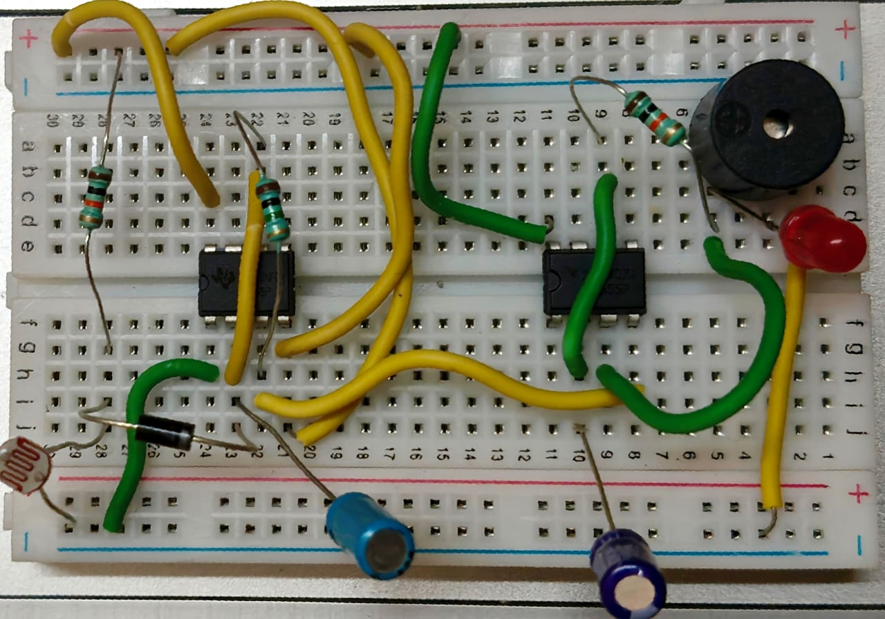

# 🧊 Fridge Door Alarm Using 555 Timer and LDR

## 🔍 Purpose
A simple low-cost system that alerts users with a buzzer if the fridge door is left open for too long. It helps save electricity and prevents food spoilage by using a 555 timer and an LDR to detect light inside the fridge.

---

## ⚙️ Project Overview
When the fridge door opens, light hits the LDR and lowers its resistance. This triggers a 555 timer (monostable mode), which starts a delay (~24 seconds). If the door remains open, a second 555 timer (astable mode) activates a buzzer until the door is closed again.

---

## 🔧 Components Used

| Component           | Description              | Quantity |
|--------------------|--------------------------|----------|
| NE555 Timer IC      | Standard timer IC        | 2        |
| LDR                | Light-dependent resistor | 1        |
| Resistors          | 10kΩ, 150kΩ, 470kΩ, 100Ω | 4        |
| Capacitors         | 47µF (Electrolytic), 0.1µF (Ceramic) | 2 |
| Diode              | 1N4007                   | 1        |
| Buzzer             | 5V sound buzzer          | 1        |
| Battery            | 9V supply                | 1        |
| Breadboard & Wires | -                        | As needed |

---

## 🧠 Time Delay Calculation

The time delay for the buzzer to start is determined by the monostable 555 timer using:

\[
T = 1.1*R*C
\]

Using:
- \( R = 470k\Omega \)
- \( C = 47\mu F \)

\[
T = 1.1*470000* 47 x 10^{-6} = \textbf{24.3 seconds}
\]

---

## 🔄 Working Mechanism

- **Door Closed** → Dark → LDR has high resistance → Timer idle.
- **Door Opened** → Light → LDR resistance drops → First timer starts delay.
- **If still open after 24s** → Second timer activates → Buzzer sounds.
- **Door Closed Again** → Light gone → LDR resets → Buzzer stops.

---

## 📐 Circuit Diagram

> 📷 _Insert circuit diagram image here_

